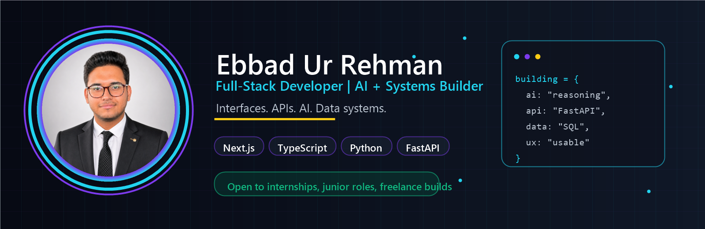

<div align="center">



<br />

<a href="https://ebbad-portfolio.vercel.app/">
  
</a>
<a href="https://www.linkedin.com/in/ebbad-ur-rehman/">
  
</a>
<a href="mailto:ebbadurrehman538@gmail.com">
  
</a>
<a href="https://github.com/ebbad-dev">
  
</a>

<br /><br />


</div>

---

## I Build Practical Software Systems

I am **Ebbad Ur Rehman**, a Software Engineering student at **COMSATS University Lahore** focused on building usable full-stack products that connect clean interfaces, reliable APIs, thoughtful database design, and applied AI.

My strongest projects are not just screens. They are complete workflows: dashboards, monitoring systems, reasoning tools, database-backed platforms, computer vision apps, automation utilities, and distributed applications.

```yaml
name: Ebbad Ur Rehman
location: Lahore, Pakistan
role: Software Engineering Student
focus: Full-stack products, AI systems, databases, backend APIs
portfolio: "https://ebbad-portfolio.vercel.app"
linkedin: "https://www.linkedin.com/in/ebbad-ur-rehman"
email: "ebbadurrehman538@gmail.com"
```

---

## Recruiter Snapshot

<table>
<tr>
<td width="25%" align="center">

### Education
BS Software Engineering  
COMSATS Lahore  
Expected 2028

</td>
<td width="25%" align="center">

### Core Stack
Next.js, React  
TypeScript, Python  
FastAPI, SQL

</td>
<td width="25%" align="center">

### Project Depth
AI platforms  
DBMS systems  
Computer vision

</td>
<td width="25%" align="center">

### Open To
Internships  
Junior roles  
Freelance builds

</td>
</tr>
</table>

---

## Signature Work

<div align="center">


</div>

| Project | What It Proves | Stack |
|---|---|---|
| **[Mirror-Mind](https://github.com/ebbad-dev/Mirror-Mind)** | AI reasoning product with argument mapping, counterclaims, evidence gaps, bilingual flows, rate limiting, and export-ready outputs. | Next.js, TypeScript, Prisma, Redis, LLMs |
| **[TeleTrack Enterprise](https://github.com/ebbad-dev/TeleTrack-Enterprise)** | Enterprise-style monitoring with devices, alerts, incidents, SLA tracking, audit logs, and operational reporting. | FastAPI, PostgreSQL, React |
| **[Proctor AI](https://github.com/ebbad-dev/Proctor-Ai)** | Computer vision workflow for live proctoring, suspicious behavior detection, incident logging, and local-first processing. | Python, OpenCV, AI/ML |
| **[My Portfolio](https://github.com/ebbad-dev/My-Portfolio)** | Recruiter-focused portfolio with interactive project presentation, polished motion, resume flow, and contact path. | Next.js, TypeScript, Tailwind, Three.js |

<div align="center">

<a href="https://github.com/ebbad-dev/Mirror-Mind">
  
</a>
<a href="https://github.com/ebbad-dev/TeleTrack-Enterprise">
  
</a>

<a href="https://github.com/ebbad-dev/Proctor-Ai">
  
</a>
<a href="https://github.com/ebbad-dev/My-Portfolio">
  
</a>

</div>

---

## Engineering Range

<table>
<tr>
<td width="50%">

### Full-Stack Products
Frontend interfaces, API design, auth-ready workflows, dashboards, reports, forms, and deployment-minded project structure.

</td>
<td width="50%">

### AI + Computer Vision
LLM workflows, reasoning systems, NLP-style processing, OpenCV pipelines, local fallback logic, and user-facing AI tools.

</td>
</tr>
<tr>
<td width="50%">

### Data-Driven Platforms
Schema design, SQL queries, reporting views, audit logs, role-based flows, data exports, and admin-style analytics.

</td>
<td width="50%">

### Backend + Systems
REST APIs, FastAPI, Flask, Java sockets, multithreading, client-server architecture, and distributed-system fundamentals.

</td>
</tr>
</table>

---

## Tech Stack

<div align="center">

[](https://skillicons.dev)

[](https://skillicons.dev)

[](https://skillicons.dev)

[](https://skillicons.dev)

[](https://skillicons.dev)

</div>

---

## GitHub Activity

<div align="center">


<br /><br />


<br /><br />

<picture>
  <source media="(prefers-color-scheme: dark)" srcset="https://raw.githubusercontent.com/ebbad-dev/ebbad-dev/output/github-contribution-grid-snake-dark.svg" />
  <source media="(prefers-color-scheme: light)" srcset="https://raw.githubusercontent.com/ebbad-dev/ebbad-dev/output/github-contribution-grid-snake.svg" />
  
</picture>

</div>

---

## Proof Points

<table>
<tr>
<td align="center" width="20%">

### 10+
GitHub repositories

</td>
<td align="center" width="20%">

### 3.4
Current CGPA

</td>
<td align="center" width="20%">

### 60+
Students represented

</td>
<td align="center" width="20%">

### 500+
Event attendees

</td>
<td align="center" width="20%">

### PKR 200K
Sponsorship secured

</td>
</tr>
</table>

---

<details>
<summary><b>More Projects</b></summary>

| Project | Type | Why It Matters |
|---|---|---|
| **[Distributed Banking System](https://github.com/ebbad-dev/distributed-banking-system)** | Distributed systems | Multi-client banking simulation with Java sockets, multithreading, and transaction consistency. |
| **[Criminal Database Management System](https://github.com/ebbad-dev/Criminal-Database-Management-System)** | Database system | Role-based criminal record system with secure search, filtering, reporting, and normalized schema. |
| **[Netflix Console](https://github.com/ebbad-dev/Netlfix-Console)** | DBMS app | Netflix-inspired CRUD app with stored procedures, triggers, views, analytics, and exports. |
| **[Student Result Management API](https://github.com/ebbad-dev/STUDENT-RESULT-MANAGEMENT-API)** | Backend API | REST API for student records, marks, result calculation, and backend workflow design. |
| **[Plagiarism Detector](https://github.com/ebbad-dev/PlagiarismDetector)** | Algorithms + NLP | Document similarity detection with word, phrase, sentence, and cosine-similarity logic. |

</details>

<details>
<summary><b>Education, Certifications, and Leadership</b></summary>

```text
BS Software Engineering
COMSATS University Islamabad - Lahore Campus
Expected Graduation: 2028
CGPA: 3.4

Certifications:
CS50: Introduction to Computer Science - Harvard
Full-Stack Web Development - Coursera
Agentic AI & Web Technology - Virtual University Bootcamp

Leadership:
Class Representative - COMSATS Lahore, 2024-present
Sponsorship Lead - TechnoVerse 2025
Private Tutor - International Teachers Academy, 2023-2025
```

</details>

<details>
<summary><b>Engineering Principles</b></summary>

```text
1. Build useful software, not only impressive screenshots.
2. Keep architecture simple before making it scalable.
3. Design databases carefully because weak schemas create weak systems.
4. Write code another developer can understand.
5. Treat serious projects like they could become real products.
6. Document the problem, not just the technology.
7. Learn fundamentals deeply, then prove them through projects.
```

</details>

---

<div align="center">

### Open to internships, junior developer roles, freelance projects, collaboration, and open-source learning.

<a href="https://ebbad-portfolio.vercel.app/">
  
</a>
<a href="https://www.linkedin.com/in/ebbad-ur-rehman/">
  
</a>
<a href="mailto:ebbadurrehman538@gmail.com">
  
</a>

<br /><br />

**Building software that connects ideas, intelligence, and real-world impact.**

</div>
