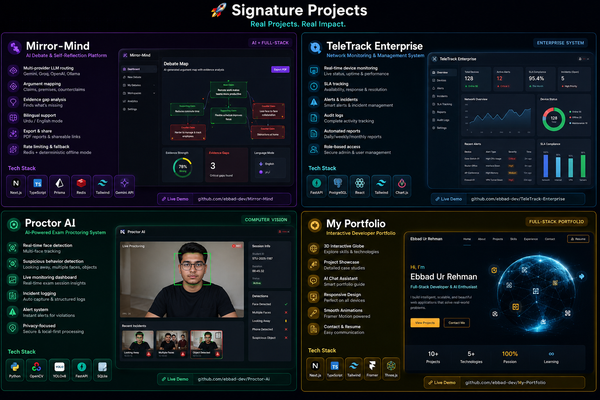
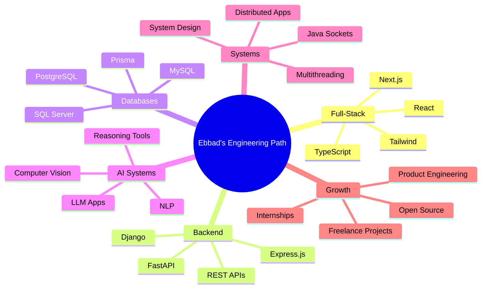

<!--
  Premium GitHub Profile README
  For: Ebbad Ur Rehman
  Profile Repository: ebbad-dev/ebbad-dev

  Required assets included in this pack:
  - assets/ebbad-profile.png
  - assets/signature-projects-showcase.png

  Snake animation workflow included:
  - .github/workflows/snake.yml
-->

<div align="center">


<br />


<br /><br />

<a href="https://git.io/typing-svg">
  
</a>

<br /><br />


<br /><br />

<a href="https://ebbad-portfolio.vercel.app/">
  
</a>
<a href="https://www.linkedin.com/in/ebbad-ur-rehman/">
  
</a>
<a href="https://github.com/ebbad-dev">
  
</a>
<a href="https://www.instagram.com/ebbad_official/">
  
</a>
<a href="mailto:ebbadurrehman538@gmail.com">
  
</a>

<br /><br />


</div>

---

<div align="center">

## Software that connects **interfaces, intelligence, data, and real-world workflows**

I am **Ebbad Ur Rehman**, a **Software Engineering student at COMSATS University Lahore** building practical systems across **Full-Stack Development, AI/ML, Databases, Backend APIs, Computer Vision, and Distributed Systems**.

</div>

---

## 🧭 Quick Recruiter View

<table>
<tr>
<td width="25%" align="center">

### 🎓 Education
BS Software Engineering  
COMSATS Lahore  
Expected 2028

</td>
<td width="25%" align="center">

### 🧠 Core Direction
Full-Stack Development  
AI/ML Systems  
Backend APIs  
Databases

</td>
<td width="25%" align="center">

### 🏗️ Project Depth
AI Platforms  
DBMS Systems  
Computer Vision  
Distributed Apps

</td>
<td width="25%" align="center">

### 🚀 Open To
Internships  
Junior Roles  
Freelance Work  
Collaboration

</td>
</tr>
</table>

---

## 👨‍💻 About Me

I do not just build screens. I try to build **complete systems**.

My strongest projects connect clean **frontend interfaces**, structured **backend APIs**, meaningful **database design**, practical **user workflows**, and sometimes an intelligent **AI or ML layer**.

I enjoy building projects that feel useful beyond coursework: dashboards, monitoring systems, reasoning tools, database-backed platforms, computer vision apps, automation tools, and distributed applications.

```yaml
name: Ebbad Ur Rehman
role: Software Engineering Student
location: Lahore, Pakistan
university: COMSATS University Islamabad - Lahore Campus
cgpa: 3.4

portfolio: "https://ebbad-portfolio.vercel.app"
github: "https://github.com/ebbad-dev"
linkedin: "https://www.linkedin.com/in/ebbad-ur-rehman"
email: "ebbadurrehman538@gmail.com"

core_stack:
  - Next.js
  - TypeScript
  - React
  - Python
  - FastAPI
  - Flask
  - Java
  - SQL
  - PostgreSQL
  - Redis

focus_areas:
  - Full-Stack Products
  - AI/ML Applications
  - Computer Vision
  - Backend APIs
  - Database Systems
  - Distributed Systems
  - System Design

open_to:
  - Software Engineering Internships
  - Junior Developer Roles
  - Freelance Web Projects
  - Open Source Collaboration
```

---

## 🧠 What I Build

<table>
<tr>
<td width="50%">

### ⚡ Full-Stack Products
I build complete applications with frontend, backend, APIs, dashboards, reporting flows, and structured databases.

</td>
<td width="50%">

### 🤖 AI-Powered Systems
I explore LLM workflows, reasoning tools, computer vision, NLP, automation, and applied AI products.

</td>
</tr>
<tr>
<td width="50%">

### 🗄️ Database-Driven Platforms
I design schemas, queries, stored procedures, reports, triggers, views, role-based access, and dashboard analytics.

</td>
<td width="50%">

### 🏗️ Engineering Systems
I work with Java sockets, multithreading, client-server architecture, REST APIs, and distributed system concepts.

</td>
</tr>
</table>

---

## 🛠️ Tech Arsenal

<div align="center">

### Languages

[](https://skillicons.dev)

### Frontend

[](https://skillicons.dev)

### Backend

[](https://skillicons.dev)

### AI / ML / Computer Vision

[](https://skillicons.dev)

### Databases

[](https://skillicons.dev)

### Tools & Platforms

[](https://skillicons.dev)

</div>

---

## 🚀 Signature Project Showcase

<div align="center">



</div>

---

## 🚀 Featured Repositories

<div align="center">

<a href="https://github.com/ebbad-dev/Mirror-Mind">
  
</a>
<a href="https://github.com/ebbad-dev/TeleTrack-Enterprise">
  
</a>

<a href="https://github.com/ebbad-dev/Proctor-Ai">
  
</a>
<a href="https://github.com/ebbad-dev/My-Portfolio">
  
</a>

</div>

---

## 🧩 Project Portfolio

| Project | Type | Tech Stack | Why It Matters |
|---|---|---|---|
| **[Mirror-Mind](https://github.com/ebbad-dev/Mirror-Mind)** | AI + Full-Stack | Next.js, TypeScript, Prisma, Redis, AI/ML | Turns opinions into structured argument maps with evidence gaps, counterarguments, and bilingual Urdu/English reasoning. |
| **[TeleTrack Enterprise](https://github.com/ebbad-dev/TeleTrack-Enterprise)** | Enterprise System | Python, FastAPI, PostgreSQL, React | Network monitoring system with device status, SLA tracking, alerts, incidents, audit logs, and automated reports. |
| **[Proctor AI](https://github.com/ebbad-dev/Proctor-Ai)** | Computer Vision | Python, OpenCV, AI/ML | Real-time exam monitoring with suspicious behavior detection and structured incident logging. |
| **[My Portfolio](https://github.com/ebbad-dev/My-Portfolio)** | Portfolio Platform | Next.js, TypeScript, Tailwind, Framer Motion, Three.js | Interactive recruiter-focused portfolio with project demos, case studies, resume, and contact flow. |
| **[Distributed Banking System](https://github.com/ebbad-dev/distributed-banking-system)** | Distributed Systems | Java, Sockets, Multithreading | Multi-client banking system demonstrating concurrency, socket programming, and transaction consistency. |
| **[Criminal Database Management System](https://github.com/ebbad-dev/Criminal-Database-Management-System)** | Database System | Java, SQL, C++ | Role-based criminal record system with secure search, filtering, reporting, and normalized schema. |
| **[Netflix Console](https://github.com/ebbad-dev/Netlfix-Console)** | Full-Stack DBMS | Python, Flask, SQL Server, HTML, CSS, JS | Netflix-inspired database app with CRUD, stored procedures, triggers, views, analytics, and export features. |
| **[Student Result Management API](https://github.com/ebbad-dev/STUDENT-RESULT-MANAGEMENT-API)** | Backend API | Node.js, Express.js, JavaScript | REST API for student records, marks, result calculation, and backend workflow design. |
| **[Plagiarism Detector](https://github.com/ebbad-dev/PlagiarismDetector)** | Algorithms + NLP | C++, Text Processing | Document similarity detection using word, phrase, sentence, and cosine similarity logic. |

---

## 🌟 Featured Project Deep Dives

<table>
<tr>
<td width="50%">

### 🧠 Mirror-Mind
An AI debate and self-reflection platform that transforms user opinions into structured reasoning maps.

**Highlights**

- Multi-provider LLM routing
- Gemini, Groq, OpenAI, and Ollama support
- Redis rate limiting
- Offline deterministic fallback
- Claim classification and counterargument generation
- Urdu/English bilingual mode
- Professional PDF export

</td>
<td width="50%">

### 📡 TeleTrack Enterprise
An enterprise-style network monitoring system for tracking devices, alerts, incidents, SLA performance, and audit logs.

**Highlights**

- FastAPI backend
- PostgreSQL database direction
- React dashboard
- Device status monitoring
- SLA tracking and incident workflows
- Audit logging
- Automated reporting

</td>
</tr>
<tr>
<td width="50%">

### 👁️ Proctor AI
A computer vision based exam monitoring system designed to reduce manual invigilation effort.

**Highlights**

- Real-time face detection
- Suspicious behavior flagging
- Configurable alert pipeline
- Structured incident logs
- Computer vision workflow
- Automation-focused design

</td>
<td width="50%">

### 🏦 Distributed Banking System
A socket-based multi-client banking system built to simulate concurrent banking workflows.

**Highlights**

- Java socket programming
- Multi-threaded server
- Concurrent client handling
- Transaction consistency
- Client-server architecture
- Stress-tested workflow design

</td>
</tr>
</table>

---

## 🏆 Proof by Numbers

<table>
<tr>
<td align="center" width="20%">

### 10+
GitHub Repositories

</td>
<td align="center" width="20%">

### 3.4
Current CGPA

</td>
<td align="center" width="20%">

### 60+
Students Represented

</td>
<td align="center" width="20%">

### 500+
Tech Event Attendees

</td>
<td align="center" width="20%">

### PKR 200K
Sponsorship Secured

</td>
</tr>
</table>

<table>
<tr>
<td width="33%">

### 🧠 AI Systems
Mirror-Mind and Proctor AI show applied AI, reasoning workflows, and computer vision experimentation.

</td>
<td width="33%">

### 🗄️ Database Systems
Netflix Console, Criminal DBMS, and TeleTrack show schema design, queries, reports, analytics, and operational workflows.

</td>
<td width="33%">

### 🏗️ Engineering Systems
Distributed Banking and backend APIs show sockets, multithreading, REST APIs, and server-side architecture.

</td>
</tr>
</table>

---

## 📊 GitHub Activity

<div align="center">


<br /><br />


<br /><br />


</div>

---

## 🐍 Contribution Snake

<div align="center">

<picture>
  <source media="(prefers-color-scheme: dark)" srcset="https://raw.githubusercontent.com/ebbad-dev/ebbad-dev/output/github-contribution-grid-snake-dark.svg" />
  <source media="(prefers-color-scheme: light)" srcset="https://raw.githubusercontent.com/ebbad-dev/ebbad-dev/output/github-contribution-grid-snake.svg" />
  
</picture>

</div>

---

## 🎓 Education & Certifications

```text
BS Software Engineering
COMSATS University Islamabad — Lahore Campus
Expected Graduation: 2028
CGPA: 3.4

Relevant Coursework:
Data Structures & Algorithms
Database Management Systems
Object-Oriented Programming
Computer Networks
Artificial Intelligence

Certifications:
CS50: Introduction to Computer Science — Harvard
Full-Stack Web Development — Coursera
Agentic AI & Web Technology — Virtual University Bootcamp
```

---

## 🧩 Experience & Leadership

<table>
<tr>
<td width="33%">

### Private Tutor
**International Teachers Academy**  
2023 – 2025

Taught CS, Maths, and Sciences to O/A Level students while strengthening communication, mentoring, planning, and explanation skills.

</td>
<td width="33%">

### Class Representative
**COMSATS Lahore**  
2024 – Present

Representing 60+ students and supporting student-faculty communication, coordination, and academic processes.

</td>
<td width="33%">

### Sponsorship Lead
**TechnoVerse 2025**

Helped secure PKR 200,000 in external funding for a 500+ attendee university tech event.

</td>
</tr>
</table>

---

## 🧠 Skill Matrix

| Area | Tools / Concepts | Current Strength |
|---|---|---|
| Frontend | React, Next.js, TypeScript, Tailwind CSS, Bootstrap | Strong and growing |
| Backend | Node.js, Express.js, Flask, FastAPI, Django | Project-used |
| Databases | MySQL, PostgreSQL, MS SQL Server, MongoDB, SQLite, Prisma, PyODBC | Strong project exposure |
| AI / ML | PyTorch, TensorFlow, OpenCV, NLP, Computer Vision | Active exploration |
| Systems | Java Sockets, Multithreading, Distributed Systems, REST APIs | Project-used |
| Tools | Git, GitHub, Docker, GitHub Actions, VS Code, IntelliJ IDEA | Daily workflow |

---

## 🗺️ Learning Roadmap



---

## 🔥 Currently Building / Improving

- AI-powered full-stack products
- Backend architecture and clean API design
- Database-heavy dashboards and admin systems
- Computer vision automation projects
- Recruiter-friendly project case studies
- Better documentation for every major repository
- System design and deployment confidence

---

## 🧪 Engineering Principles

```text
1. Build useful software, not only impressive screenshots.
2. Keep architecture simple before making it scalable.
3. Design databases carefully because weak schemas create weak systems.
4. Write code another developer can understand.
5. Treat every serious project like it could become a real product.
6. Document the problem, not just the technology.
7. Learn fundamentals deeply, then prove them through projects.
```

---

## 💬 Ask Me About

<div align="center">


</div>

---

## 🤝 Open To

<table>
<tr>
<td width="20%" align="center">

### Internship
Software Engineering  
Full-Stack  
Backend  
AI/ML

</td>
<td width="20%" align="center">

### Junior Roles
Frontend  
Backend  
APIs  
Dashboards

</td>
<td width="20%" align="center">

### Freelance
Portfolios  
Web Apps  
Dashboards  
Database Systems

</td>
<td width="20%" align="center">

### Collaboration
AI Tools  
Open Source  
Educational Software  
Developer Tools

</td>
<td width="20%" align="center">

### Growth
Mentorship  
Code Reviews  
Project Learning  
Product Engineering

</td>
</tr>
</table>

---

## 🌐 Connect With Me

<div align="center">

<a href="https://ebbad-portfolio.vercel.app/">
  
</a>
<a href="https://www.linkedin.com/in/ebbad-ur-rehman/">
  
</a>
<a href="https://github.com/ebbad-dev">
  
</a>
<a href="https://www.instagram.com/ebbad_official/">
  
</a>
<a href="mailto:ebbadurrehman538@gmail.com">
  
</a>

<br /><br />

### Open to internships, junior developer roles, freelance projects, collaboration, and open-source learning.

<br />

**“Building software that connects ideas, intelligence, and real-world impact.”**


</div>
